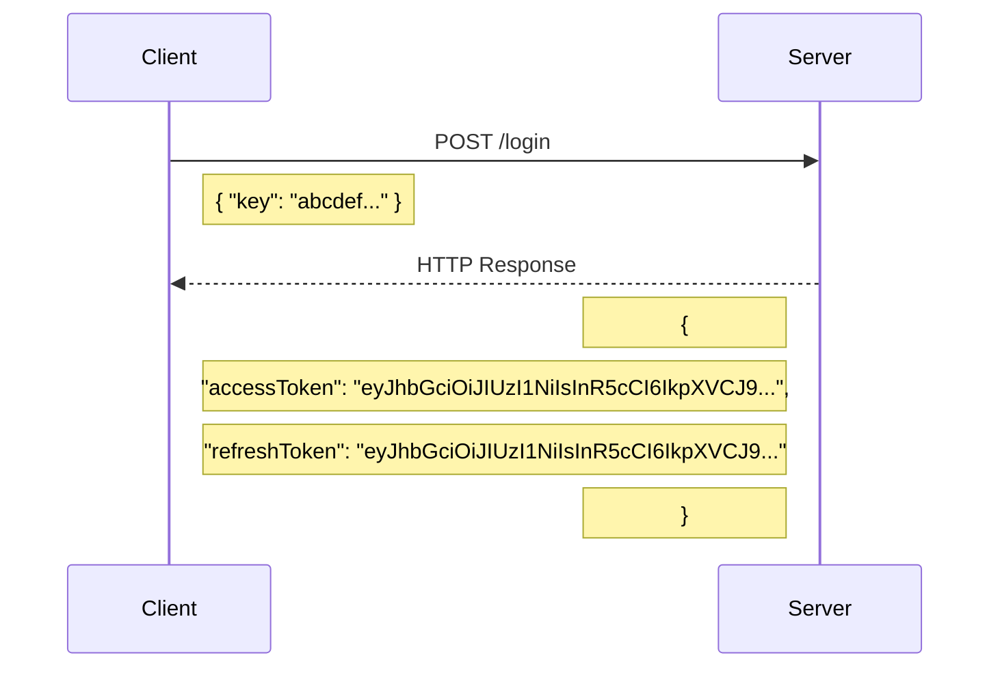

# Partner REST API

## Authentication

# Tech Debt:

### Tests

- unit testing for libs
- unit testing for controller services
- add graphql resolvers (code first)
- app-wide e2e test
- architecture documentation
- encryption key cycling endpoints
- TOTP for MFA upon login
- swagger descriptions, input & output
